# FAANG-Level Architecture & Production Readiness Audit

## Maya AI Concierge — Mobile Detailing Booking Agent

**Audit Date:** July 24, 2026
**Auditor:** Principal AI/Systems Engineer
**Repository:** `Mr-Cleaner-AI-Employee`
**Scope:** Full codebase — 27 lib modules, 19 API routes, 208 tests, 17+ frontend components, middleware, config

---

## Executive Summary

**Verdict: CONDITIONAL PASS — NEAR PRODUCTION-READY**

This is a remarkably well-engineered AI agent system for a solo developer project. The architecture demonstrates mature understanding of production concerns — multi-tenancy, rate limiting, webhook verification, PII redaction, bilingual support, and model failover are all present, which puts this head and shoulders above typical MVP work.

**Overall Score: 7.3 / 10**

The system handles the core booking flow with production-level rigor. However, 4 critical bugs and 12 high-severity issues exist that would cause runtime failures or data leaks in a multi-tenant production deployment. Most are small, fixable oversights — not architectural flaws.

### Risk Summary

| Severity | Count | Primary Areas |
|---|---|---|
| **CRITICAL** | 4 | Runtime crashes, broken function, data corruption, type hazard |
| **HIGH** | 12 | Data leaks, silent failures, race conditions, unenforced policies |
| **MEDIUM** | 15 | Observability gaps, caching bugs, error handling, monitoring |
| **LOW** | 10 | Documentation, code cleanup, edge case hardening |

---

## Scoring Matrix (1–10)

| Category | Score | Key Strengths | Key Weaknesses |
|---|---|---|---|
| **Agent Architecture** | 8.0 | Clean orchestration loop, tool-calling, model failover, multi-channel | sessionLanguage RACE, no graceful degradation on all-models-fail |
| **Prompt Engineering** | 8.5 | Well-structured, bilingual, injection detection, tool guidelines | No anti-hallucination constraints, no output validation |
| **Security** | 7.0 | Multi-tenant scoping, HMAC webhooks, PII redaction, rate limiting | 2 CRITICAL bugs, API key in URL query param, no encryption at rest |
| **Data Management** | 6.5 | Multi-tenant schema, Redis caching, memory fallback | Cache type corruption, missing business_id on analytics (FIXED), no transactions |
| **Error Handling** | 6.0 | Sentry integration, structured logging, tryRedisOp pattern | Empty catch blocks, undeployed error-report.js, fire-and-forget promises |
| **Testing** | 8.5 | 208 tests, 17 files, good coverage across all modules | No integration tests against real DB, no load tests, no fuzzing |
| **Performance** | 7.5 | Redis caching, lazy init, model failover | No advisory locks, Vercel-cold-start latency, in-memory rate limiter per-instance |
| **Scalability** | 7.0 | Multi-tenant ready, stateless API, Redis backend | State in local memory for rate limits, no connection pooling |
| **Observability** | 6.5 | Sentry structured logging request IDs | error-report.js unused, no health check for downstream deps, no metrics |
| **Code Quality** | 8.0 | Excellent JSDoc, consistent patterns, modular architecture | Minor anti-patterns (fire-and-forget, null swallows) |
| **API Design** | 8.0 | RESTful, proper status codes, structured errors, Zod validation | Missing idempotency keys on webhooks |
| **Frontend** | 7.5 | Framer Motion, CSS modules, dark mode, accessibility (focus trap, focus-visible) | No offline state, no service worker, no error boundaries on all components |
| **Dev Experience** | 8.0 | Setup wizard, env validation, comprehensive docs (STAGING, DEPLOY, etc.) | Missing local dev telemetry, no hot reload for env changes |
| **Deployment** | 8.5 | Vercel auto-deploy, staging env setup, vercel.json ready | No canary/smoke test in CI, no rollback strategy documented |

### Weighted Overall: 7.3 / 10

---

## CRITICAL Issues (4)

### C1. `sessionLanguage` Reference Before Definition — Runtime Crash
**File:** `lib/maestro.js:144`
**Severity:** CRITICAL — Runtime ReferenceError

```javascript
// Line 144 — sessionLanguage is NOT defined yet
if (!hasAnyAI) {
    const simMsg = sessionLanguage === 'es'  // ReferenceError!
        ? "El motor de IA..."
        : "Maya's AI engine is currently in simulation mode.";
    return {
        role: 'assistant',
        content: simMsg,
        mock: true,
        language: sessionLanguage,  // ReferenceError!
    };
}
// sessionLanguage is first defined at line 172
```

**Root Cause:** The `!hasAnyAI` early-return path (lines 144-154) is executed before `sessionLanguage` is declared/assigned on line 172. Any deployment without a Gemini (or alternative) API key will crash on every request to the chat endpoint.

**Business Impact:** If the developer deploys without configuring at least one AI API key (or if all keys are revoked), the booking agent is completely inoperable. Every chat request returns HTTP 500. The simulation mode is dead code.

**Fix:**
```javascript
export async function orchestrateMaya({ ... }) {
    const sessionLanguage = 'en'; // Default early, overridden later

    if (!hasAnyAI) {
        return { ... };
    }
    // ... rest of function
    // Override sessionLanguage after DB load
}
```

---

### C2. `processRefundWithCancel()` Missing businessId — Completely Broken
**File:** `lib/refund.js:126-127`
**Severity:** CRITICAL — Function always fails

```javascript
export async function processRefundWithCancel(bookingId) {
    const result = await processRefund(bookingId);
    //                              ^^^ missing businessId!
    // processRefund checks: if (!businessId) return { error: 'UNAUTHORIZED' }
```

**Root Cause:** `processRefund(bookingId, businessId)` requires `businessId` as the second parameter (for cross-tenant security). `processRefundWithCancel` passes only `bookingId`, so `businessId` is `undefined`, triggering the guard at line 42-44: `{ success: false, error: { code: 'UNAUTHORIZED' } }`.

**Business Impact:** The "cancel and refund" dashboard feature is completely non-functional. Every refund that requires calendar cancellation (which should be common) fails silently in the UI.

**Fix:**
```javascript
export async function processRefundWithCancel(bookingId, businessId) {
    const result = await processRefund(bookingId, businessId);
    // ... rest
}
```

---

### C3. Redis Cache Corrupts Data Types on Round-Trip
**File:** `lib/tools.js:49-53`
**Severity:** CRITICAL — Data corruption

```javascript
const cached = await tryRedisOp(async (redis) => {
    const val = await redis.get(cacheKey);
    return val || null;
});
if (cached) return cached; // Returns JSON string, not parsed object

// Meanwhile: redis.set(cacheKey, result, ...) stores as JSON string
// Consumer expects: { sedan: 120, SUV: 150 } (object)
// Gets: '{"sedan":120,"SUV":150}' (string)
```

**Root Cause:** Upstash Redis stores objects as JSON strings. When reading back via `.get()`, the value is a string. But `getKnowledge()` returns it as-is without `JSON.parse()`. Callers accessing `result.sedan` on a string get `undefined`.

**Business Impact:** After the first cache write, ALL subsequent getKnowledge calls for that key return corrupted data. Pricing lookups return `undefined`, breaking the entire quote calculation flow. Service area checks fail. This is a production-silent data corruption bug.

**Fix:**
```javascript
if (cached) {
    // Upstash Redis returns JSON strings — parse back to object
    return typeof cached === 'string' ? JSON.parse(cached) : cached;
}
```

---

### C4. Unvalidated `x-business-id` Header — Direct Object Reference Attack
**File:** `lib/tenant.js:32-34`
**Severity:** CRITICAL — Authorization bypass

```javascript
const headerBusinessId = request?.headers?.get('x-business-id');
if (headerBusinessId && isValidUUID(headerBusinessId)) {
    return headerBusinessId; // No authentication check!
}
```

**Root Cause:** The `x-business-id` header is accepted without any authentication. Any client (including a curl request from an attacker) can set this to any valid UUID. The header is used pervasively — all API routes that resolve business context use `resolveBusinessId(request)`, which trusts this header.

**Impact:** An attacker who discovers a valid business UUID can:
1. Access `/api/bookings?businessId=<other-uuid>` to see other businesses' data
2. Potentially make bookings on behalf of other businesses
3. Read analytics data across tenants

**Fix:** Require authentication for `x-business-id` or only accept it from trusted sources (internal requests, webhook callbacks). For API routes, derive business ID from session/JWT, not from a client-supplied header:
```javascript
export async function resolveBusinessId(request) {
    // 1. First check authenticated session
    const jwtBusinessId = await extractFromJWT(request);
    if (jwtBusinessId) return jwtBusinessId;
    // 2. Fall back to header only for internal/trusted callers
    // 3. Default for now
    return DEFAULT_BUSINESS_ID;
}
```

---

## HIGH-Severity Issues (12)

### H1. No Advisory Lock for Calendar Double-Booking
**Files:** `lib/calendar.js`, `lib/supabase.js:createBooking()`
**Impact:** Race condition — two concurrent requests can book the same slot before the DB constraint fires.

**Current defense:** The unique constraint `idx_unique_slot` on `(business_id, booking_date, booking_time WHERE status != 'cancelled')` is a last-line defense. But it catches the error AFTER insertion, returning a `23505` error. The customer may see "booking failed" after being told a slot was available.

**Fix:** Use PostgreSQL advisory lock (`pg_try_advisory_xact_lock`) or SELECT ... FOR UPDATE in the `checkAvailability` → `createBooking` transaction path. Alternatively, use a Redis distributed lock (SET NX with TTL = slot duration).

---

### H2. GBP API Key in URL Query Parameter
**File:** `lib/gbp.js:~156`
**Impact:** API key leaked in server logs, proxy logs, and URL history.

```javascript
const url = `https://mybusinessbusinessinformation.googleapis.com/v1/accounts/${accountId}/locations/${locationId}?key=${GBP_API_KEY}`;
```

**Fix:** Use `Authorization: Bearer` header instead of query parameter. Google's Business API supports OAuth2 tokens. Create a service account and use OAuth2 instead of API key:
```javascript
const headers = { 'Authorization': `Bearer ${accessToken}` };
```

---

### H3. OAuth Tokens Stored Without Encryption at Rest
**Files:** `lib/calendar.js`, `lib/jobber.js`, `supabase/multi-tenancy-migration.sql` (integrations table)
**Impact:** If Supabase is compromised, all OAuth tokens (Google Calendar, Jobber) are readable in plaintext.

**Fix:** Use Supabase's `pgcrypto` extension or encrypt tokens with a server-side key before storage:
```sql
-- Use pgp_sym_encrypt() from pgcrypto extension
UPDATE integrations SET access_token = pgp_sym_encrypt($1, current_setting('app.encryption_key'));
```

---

### H4. Webhook Idempotency Missing for Stripe/Meta/Jobber
**Files:** `app/api/stripe/webhook/route.js`, `app/api/webhook/meta/route.js`, `app/api/integrations/jobber/route.js`
**Impact:** Duplicate webhook deliveries cause duplicate bookings (Stripe), duplicate responses (Meta), duplicate jobs (Jobber).

Stripe webhooks can be delivered multiple times (especially on network failures). The current dedup relies on `stripe_session_id` uniqueness constraint — but only for Stripe. Meta and Jobber have no idempotency at all.

**Fix:** Add idempotency key checking using Redis SET NX for all webhook endpoints:
```javascript
const dedupKey = `webhook:${provider}:${idempotencyKey}`;
const alreadyProcessed = await tryRedisOp(r => r.set(dedupKey, '1', { nx: true, ex: 86400 }));
if (!alreadyProcessed) return Response.json({ status: 'duplicate' });
```

---

### H5. Empty `catch` Blocks Swallow Errors
**Files:** `lib/meta.js:233`, `lib/tenant.js:100-103`, `lib/refund.js:143-145`
**Impact:** Complete observability black hole. Errors happen silently — no logs, no Sentry, no debugging.

```javascript
// lib/tenant.js:100-103
} catch {
    return null;
}
// lib/refund.js:143-145
} catch {
    // Calendar cancellation is best-effort
}
```

**Fix:** At minimum, add a `console.error` log. Sentry capture is preferred for non-trivial paths:
```javascript
} catch (error) {
    console.error('Failed to cancel calendar event:', error.message);
}
```

---

### H6. `getBookings()` Falls Back to Memory Store on Any DB Error
**File:** `lib/supabase.js:parseInt(133)`
**Impact:** A transient network error (e.g., Supabase connectivity blip) returns stale local data silently. The dashboard shows outdated bookings and the owner doesn't know data is stale.

**Fix:** Differentiate between "DB not configured" (graceful fallback) and "transient error" (return error, don't silently serve stale data).

---

### H7. `error-report.js` Is Unused Dead Code
**File:** `lib/error-report.js` — 80 lines, never imported by any module
**Impact:** All modules use ad-hoc pattern: some use `console.error`, some use `Sentry.captureException`, some do nothing. No consistent error reporting taxonomy.

**Fix:** Either delete the dead module or actually wire it into all error paths. Standardize all error reporting through `reportError` / `reportWarning` wrappers.

---

### H8. CSRF Bypass — Requests Without Origin/Referer Are Allowed
**File:** `lib/csrf.js:86`
**Impact:** Direct API calls from scripts (curl, Postman, automated bots) bypass CSRF protection entirely. Stripe webhooks are correctly excluded, but all other state-changing endpoints are vulnerable to scripted CSRF attacks.

**Fix:** For dashboard endpoints, require Origin or Referer header in production. For API-only consumers (webhooks, integrations), use API keys or signed requests instead.

---

### H9. In-Memory Rate Limiter Is Per-Vercel-Instance
**File:** `lib/rate-limit.js` (in-memory fallback)
**Impact:** Vercel runs on serverless architecture with multiple concurrent instances. Each instance has its own in-memory Map. A burst of 30 requests from one IP could be distributed across 3 instances, each allowing 20 requests — effectively tripling the rate limit.

**Fix:** Document that in-memory mode is for local dev only. In production, REQUIRE Redis for rate limiting. Add a startup warning:
```javascript
if (!process.env.UPSTASH_REDIS_REST_URL) {
    console.warn('WARNING: No Redis configured — rate limiting is per-instance only');
}
```

---

### H10. Weather Fallback Returns Random Results
**File:** `lib/tools.js:check_weather()` — uses `Math.random()`
**Impact:** Consecutive calls for the same date can return "sunny" then "rainy". The LLM gets contradictory information, undermines user trust.

**Fix:** Use date-based deterministic seed (`seededRandom(dateString)`) so the same date always returns the same fallback forecast.

---

### H11. SMS Body Not Truncated
**File:** `lib/twilio.js:sendSMS()`
**Impact:** Twilio single-segment SMS limit is 160 characters. Multi-segment (concatenated) limit is ~1600 characters. Long AI-generated messages could be silently truncated or rejected.

**Fix:** Truncate to 1500 characters with a "... (continued)" footer, or use Twilio's messaging service with automatic concatenation.

---

### H12. `resolveBusinessByMetaId` / `resolveBusinessByLocationId` Have Bare try/catch
**Files:** `lib/meta.js:~220`, `lib/tenant.js:100-103`
**Impact:** If the query fails (network error, timeout), the function returns null with no error trace. The webhook handler then processes the event as "unowned" — potentially dropping legitimate messages.

**Fix:** Log errors before returning null. Consider Sentry capture for DB failures.

---

## MEDIUM-Severity Issues (15)

### M1. `withTimeout` Doesn't Cancel Underlying Operations
**File:** `lib/timeout.js`
**Impact:** When an AI model call times out, `Promise.race` returns the timeout result, but the underlying `fetch`/`openai` request continues running in the background. On Vercel's serverless platform, this wastes resources and may cause concurrent request buildup.

**Fix:** Use `AbortController` to actually cancel the in-flight request:
```javascript
const controller = new AbortController();
const timeout = setTimeout(() => controller.abort(), ms);
try {
    return await fn({ signal: controller.signal });
} finally {
    clearTimeout(timeout);
}
```

### M2. No Health Check for Downstream Dependencies
**File:** `app/api/health/route.js`
**Impact:** The health endpoint doesn't check Supabase connectivity, Redis connectivity, or AI API availability. Monitoring systems can't tell if booking is functional.

### M3. No Rate Limit on Webhook Endpoints
**Files:** All webhook routes (`/api/webhook/*`, `/api/integrations/*`)
**Impact:** Webhooks from Meta/Google/Jobber are not rate-limited. A misconfigured webhook could flood the system.

### M4. `logEvent` Is Fire-and-Forget Without Error Handling
**File:** `lib/maestro.js:47-57`
**Impact:** Log failures are silently swallowed (the `.catch()` logs to console but doesn't track it). If `usage_logs` table has issues, analytics go blind silently.

### M5. `application_config` Tokens Never Cleaned Up
**File:** `lib/calendar.js` — Google Calendar tokens stored in `application_config` table
**Impact:** When Google Calendar integration is disabled or re-configured, old tokens remain in the DB forever. No garbage collection.

### M6. No Database Migration Versioning
**Files:** `supabase/schema.sql`, `supabase/multi-tenancy-migration.sql`, `supabase/vehicle-photos-migration.sql`
**Impact:** SQL files must be run manually in order. No migration tool (Flyway, Prisma, Knex). No rollback capability.

### M7. `combineDateTime` May Not Parse 24-Hour Format
**File:** `lib/jobber.js`
**Impact:** `booking_time` stored as `14:00:00` (24h format) — the regex `\s*(AM|PM)` won't match, returning `undefined`. Jobber jobs created without proper timestamps.

### M8. No `business_id` on Google Calendar Events
**File:** `lib/calendar.js`
**Impact:** Calendar events are created without any business identifier in the event description/metadata. Future multi-tenant wouldn't know which business owns which event.

### M9. Memory Store Has No Expiry
**File:** `lib/supabase.js`
**Impact:** The in-memory fallback store grows unboundedly during a session. For active sites, this can cause out-of-memory crashes.

### M10. `getBookedTimesForDate` Queries Without Index-Friendly Sort
**File:** `lib/calendar.js:170`
**Impact:** Querying `booking_time` as a string requires type conversion for time-based filtering. No index on `(business_id, booking_date, booking_time)` for optimal speed.

### M11. No Fallback for Resend Email Failures
**File:** `lib/email.js`
**Impact:** No retry logic. If Resend API returns a 5xx, the email confirmation is silently lost. Customer doesn't receive booking confirmation.

### M12. `getSession()` Warnings in All Routes
**File:** Many API routes — session auth check is inconsistent
**Impact:** Some routes verify session in middleware, others in handler, others assume middleware handles it. Fragile — if middleware config changes, routes are unprotected.

### M13. No Request Body Size Limit for Upload Endpoint
**File:** `app/api/upload/route.js`
**Impact:** Large image uploads (10MB+) could exhaust memory. Sharp processing has a memory ceiling.

### M14. Static Landing Page Data Not Configurable Per-Business
**File:** `app/page.js` — testimonials, stats, services are hardcoded
**Impact:** In multi-tenant mode, each business should customize their landing page. Currently all share the same content.

### M15. `promptInjection` Detection Only Checks Last User Message
**File:** `lib/maestro.js:250-251`
**Impact:** An attacker could spread injection across multiple messages. Only the most recent is checked.

---

## LOW-Severity Issues (10)

### L1. Typos / Minor Cleanup
- `supabase.js`: Comment says "in-tact" (should be "intact")
- `gbp.js`: Some console logs inconsistent format

### L2. Test Coverage Gaps
- No tests for `processRefundWithCancel`
- No tests for empty Redis cache scenario
- No tests for `getKnowledge` Redis cache round-trip

### L3. `authService` Unused Import
- Some routes may import modules they don't directly use

### L4. No Rate Limiter Reset Endpoint for Testing
- Tests call `resetRateLimiters()` directly — only works in-process

### L5. Environment Variables Without Type Coercion
- Some boolean env vars read as strings ('true' !== true)

### L6. Hardcoded `$50` Deposit Amount
- `generate_deposit_link` uses hardcoded $50 — not configurable per-business

### L7. No ESLint on Tests
- Test files have various style inconsistencies

### L8. `next.config.mjs` Hardcodes Sentry Auth Token
- Should use env var for `SENTRY_AUTH_TOKEN`

### L9. Service Worker / PWA Not Configured
- No offline experience for the dashboard

### L10. No Robots.txt / SEO Optimization
- `robots.txt` not present — search engines index everything or nothing

---

## Architecture Recommendations

### Short-Term (Fix Before Production Multi-Tenant)

1. **Fix C1-C4** — These ARE runtime blockers. Fix sessionLanguage, refundWithCancel, Redis cache, and x-business-id before enabling multi-tenant mode.

2. **Add Business ID to Calendar Events** — Store `business_id` in the Google Calendar event description/metadata. Required for multi-tenant calendar reconciliation.

3. **Standardize Error Reporting** — Either use `error-report.js` everywhere or remove it. Pick one pattern (Sentry + structured console) and apply consistently.

4. **Implement Webhook Idempotency** — Redis-backed dedup for all three webhook providers (Stripe, Meta, Jobber). Prevents duplicate bookings, responses, and jobs.

5. **Add Advisory Lock for Calendar** — Prevent the race condition between `checkAvailability` and `createBooking`. Use Redis distributed lock or PostgreSQL advisory lock.

### Medium-Term (Next 2-3 Sprints)

6. **Database Migration System** — Replace manual SQL files with a proper migration tool. Enable rollback, version tracking, and CI-applied migrations.

7. **Encrypt OAuth Tokens at Rest** — Use `pgcrypto` or envelope encryption with KMS for all stored tokens and secrets.

8. **Implement Rate Limiting on Webhooks** — Prevent runaway webhook floods from misconfigured provider integrations.

9. **Add Request ID Propagation** — Request IDs are generated in each route but not consistently passed downstream. Standardize cross-cutting trace IDs.

10. **Migrate to `middleware.js` → `proxy.js`** — Next.js 16 deprecates middleware in favor of proxy. Plan migration before Next.js 17.

### Long-Term (Enterprise Scale)

11. **Observability Stack** — Replace ad-hoc console.logs with structured logging (pino/bunyan). Add OpenTelemetry instrumentation for distributed tracing.

12. **Advanced Caching Strategy** — Multi-layer cache (memory → Redis → DB). Write-through for knowledge base changes. Cache warming at business configuration time.

13. **Load Testing & Chaos Engineering** — Formal load testing against the booking flow. Redis/calendar outage scenarios. Test multi-tenant data isolation under load.

14. **White-Label Deployment Portal** — Self-service UI for new businesses to deploy their own Maya instance. Automated tenant provisioning.

---

## Agent Workflow Critique

### Current Architecture Assessment

```
Maya's agent loop is well-structured:
1. Language detection → 2. Business config resolution
3. Prompt injection check → 4. LLM call (with 3-model failover)
5. Tool execution → 6. State sync → 7. Session persistence
```

**What's done right:**
- **Structured tool definitions with Zod validation** — Excellent defense against LLM hallucinated arguments
- **Conversation pruning with tool-pair integrity** — Prevents orphan tool calls that confuse models
- **Graceful model failover** — Gemini → DeepSeek → OpenAI with timeout per model
- **PII redaction before logging** — Names/phones masked in all log paths
- **Bilingual prompt generated dynamically** — Not a static template, respects detected language

**What needs improvement:**

| Gap | Impact | Fix |
|---|---|---|
| No system prompt anti-hallucination guard | LLM may invent service tiers or prices | Add "If unsure, use calculate_quote tool — never guess pricing" |
| No output validation on LLM response | Hallucinated facts returned to customer | Zod schema on final output |
| No circuit breaker for repeated model failures | All 3 models tried every time even after repeated failures | Add failure counter + cooldown per model |
| No conversation length limit | Long chats incur unbounded AI costs | Hard limit on iterations (currently 5) + max tokens per call |
| No user feedback loop | Can't measure booking quality | Add thumbs up/down on responses |
| System prompt grows with business config | No upper limit on prompt size | Cap config at 4K tokens, truncate if needed |

### Suggested Agent Architecture Evolution

```mermaid
flowchart TB
    subgraph "Current"
        CHAT[Incoming Message] --> LLM[LLM Call<br/>Gemini→DeepSeek→OpenAI]
        LLM --> TOOL{Has Tool Calls?}
        TOOL -->|Yes| EXEC[Execute Tool<br/>Zod Validation]
        EXEC --> LLM
        TOOL -->|No| RESPOND[Return Response]
    end

    subgraph "Recommended Evolution"
        CHAT2[Incoming Message] --> GUARD[Input Guard<br/>Injection + Toxicity + PII]
        GUARD --> RETRIEVE[Retrieval<br/>Knowledge Base + Context]
        RETRIEVE --> PROMPT[Dynamic Prompt Assembly<br/>System + Few-shot + Context]
        PROMPT --> LLM2[LLM Call<br/>With Circuit Breaker]
        LLM2 --> VALIDATE[Output Validation<br/>Schema Check + Hallucination Guard]
        VALIDATE --> TOOL2{Has Tool Calls?}
        TOOL2 -->|Yes| EXEC2[Execute Tool<br/>With Locking + Idempotency]
        EXEC2 --> RETRIEVE
        TOOL2 -->|No| RESPOND2[Format + Log + Respond]
        RESPOND2 --> FEEDBACK[Feedback Loop<br/>Rating + Analytics]
    end
```



---

## Cost Analysis

### Current Monthly Operating Cost (Single Business)

| Service | Tier | Est. Monthly Cost |
|---|---|---|
| Vercel Pro | Hobby (free) | $0 |
| Supabase | Free tier (500MB DB) | $0 |
| Upstash Redis | Free tier (10K commands/day) | $0 |
| Gemini 2.0 Flash | Free (15 RPM) | $0 |
| Stripe | 2.9% + $0.30 per transaction | ~$30-60 (pass-through) |
| Twilio | $0.0079/SMS segment | ~$5-20 |
| Resend | Free (100 emails/day) | $0 |
| Sentry | Free (5K events/month) | $0 |
| **Total** | | **<$30/month** |

### Scaling Costs (30 Businesses)
- Upstash Redis: $25/month (Pro)
- Supabase: $25/month (Pro)
- Vercel: $20/month (Pro)
- **Total: ~$70/month + transaction fees**
- ~$2.33/month per business at 30 tenants

### Revenue Potential
- Each business doing 5 bookings/week at $300 avg = $78K/year/business
- If Maya captures 20% more bookings = $15.6K incremental revenue/business
- Pricing at $199/month/business = $5,970/month MRR at 30 tenants
- Take rate of 2% on bookings = $234/month at current volumes

---

## Prioritized Action Plan

### Week 1 — Patch Critical Bugs
| # | Issue | Effort | Risk |
|---|---|---|---|
| 1 | C1: sessionLanguage ReferenceError | 5 min | None |
| 2 | C2: processRefundWithCancel broken | 5 min | None |
| 3 | C3: Redis cache data type corruption | 15 min | Low |
| 4 | C4: Unvalidated x-business-id | 1 hour | Low |

### Week 2 — Security Hardening
| # | Issue | Effort | Risk |
|---|---|---|---|
| 5 | H2: GBP API key from URL → Auth header | 2 hours | Low |
| 6 | H3: Encrypt OAuth tokens at rest | 4 hours | Medium (schema change) |
| 7 | H4: Webhook idempotency | 3 hours | Low |
| 8 | H8: CSRF hardening | 1 hour | Low |
| 9 | H9: Rate limiter per-instance warning | 30 min | None |

### Week 3 — Production Hardening
| # | Issue | Effort | Risk |
|---|---|---|---|
| 10 | H1: Advisory lock for calendar | 4 hours | Medium |
| 11 | H5: Empty catch blocks | 1 hour | Low |
| 12 | M1: AbortController for AI model calls | 2 hours | Low |
| 13 | M6: Database migration system | 8 hours | Medium |
| 14 | M7: jobber.js 24h time format | 30 min | Low |

### Week 4 — Observability & Monitoring
| # | Issue | Effort | Risk |
|---|---|---|---|
| 15 | H7: Wire up error-report.js or remove it | 4 hours | Low |
| 16 | M2: Health check improvements | 2 hours | Low |
| 17 | M3: Webhook rate limiting | 2 hours | Low |
| 18 | M4: logEvent error handling | 1 hour | Low |
| 19 | Agent workflow improvements (circuit breaker, output validation) | 8 hours | Medium |

---

## Final Verdict

**This codebase demonstrates senior-level engineering judgment.** The architecture is modular, well-documented, and security-conscious. The developer clearly understands production concerns (rate limiting, webhook verification, PII redaction, multi-tenancy) that most junior engineers overlook.

**The system is NOT production-ready for multi-tenant deployment** due to 4 critical bugs, but IS production-ready for single-tenant with caveats:

### Single-Tenant Verdict: ✅ READY (with conditions)
- Fix C1 and C2 first (15 minutes total)
- Deploy with Redis configured (required for rate limiting)
- Monitor Sentry for first week

### Multi-Tenant Verdict: ❌ NOT READY
- Fix C1-C4 (critical)
- Fix C4 (x-business-id) — fundamental to tenant isolation
- Add business_id to calendar events (M8)
- Implement webhook idempotency (H4)
- Remove empty catch blocks (H5)

### What Makes This Senior-Level:
- **Excellent documentation** — Every module has thoughtful JSDoc explaining WHY
- **Multi-tenant data model** — Designed upfront, not retrofitted
- **Testing discipline** — 208 tests, 17 test files, good patterns
- **Security awareness** — Rate limiting, PII redaction, HMAC verification
- **Cost consciousness** — Free tier optimization, lazy initialization

### What Needs Senior-Level Improvement:
- **Systematic error handling** — Not ad-hoc, not empty catches
- **Observability** — OpenTelemetry, structured logging, health checks
- **Distributed systems thinking** — Advisory locks, idempotency, circuit breakers
- **Testing** — Integration tests against real DB, load tests

**Score: 7.3/10** — A B+ grade. With the 4 critical fixes (estimated 1.5 hours), it becomes 7.8/10. With the full action plan (estimated 2-3 sprints), it reaches 9.0+/10.

---
