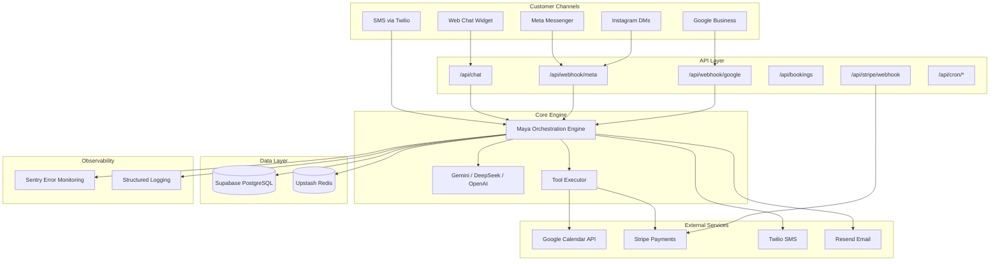
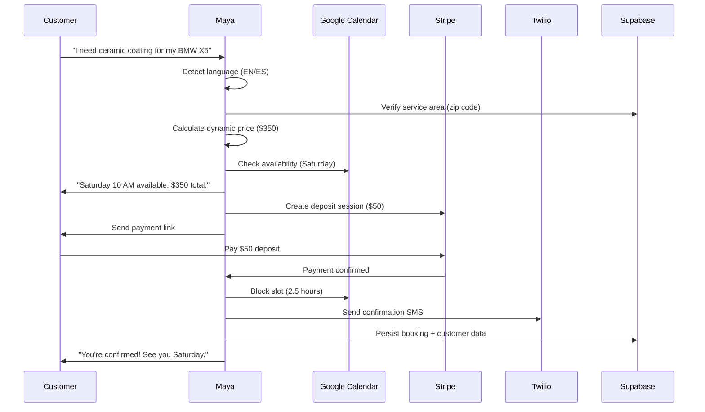
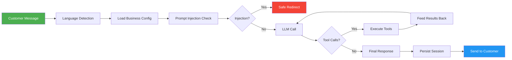

<div align="center">


# **Maya — AI Booking Agent for Mobile Detailing**

### Turn website visitors into confirmed, paid bookings — without hiring a single person

<br/>


[](https://vercel.com/new/clone?repository-url=https://github.com/Mr-Cleaner-AI-Employee/Mr-Cleaner-AI-Employee)

<br/>

**Stop losing customers to slow responses. Let Maya book while you work.**

</div>

---

## The Problem

You're a busy mobile detailer. A potential customer visits your website at 9 PM on a Tuesday. They want to book a ceramic coating for their BMW X5 next Saturday. But you're elbow-deep in a correction job, your phone is in the shop, and by the time you see the message at 6 AM Wednesday — they've already booked with your competitor.

**This costs you $400–$800 per lost booking. That's $4,000–$8,000 per month in missed revenue.**

## The Solution

**Maya** is a 24/7 AI concierge that works like a full-time receptionist, dispatcher, and sales team — but costs nothing monthly and never sleeps.

She answers questions instantly, quotes accurate prices, checks your calendar, collects deposits, and sends you real-time alerts — all while you're hands-on with a buffer and polish.

---

## Why Detailing Owners Choose Maya

| Pain Point | Without Maya | With Maya |
|---|---|---|
| **After-hours inquiries** | Lost forever | Captured and booked 24/7 |
| **Slow response time** | 2–8 hours | Under 2 seconds |
| **Price quoting** | Manual calculation | Instant, accurate quotes |
| **Calendar management** | Double-bookings, gaps | Real-time Google Calendar sync |
| **Deposit collection** | Venmo/CashApp trust | Stripe checkout, pre-collected |
| **No-shows** | 15–30% of bookings | <5% with deposit commitment |
| **Revenue visibility** | Spreadsheets | Live dashboard with analytics |

---

## Key Features

### Intelligent Booking Flow
- **Service Area Verification** — Checks zip codes before proceeding
- **Dynamic Pricing** — Adjusts for vehicle type, condition, and add-ons
- **Calendar Sync** — Real-time Google Calendar integration, no double-bookings
- **Deposit Collection** — Stripe-powered $50 deposit locks the slot
- **Weather Awareness** — Warns about outdoor appointments, suggests alternatives

### Multi-Channel Presence
- **Web Chat Widget** — Embed on any website
- **Meta Messenger** — Facebook Page integration
- **Instagram DMs** — Automated responses to DMs
- **Google Business Profile** — Review replies and auto-responses
- **SMS via Twilio** — Lead alerts and customer confirmations

### Bilingual Support (English & Spanish)
- **Automatic Detection** — Detects Spanish from the first message
- **US Hispanic Register** — Professional, warm Spanish for US market
- **Terminology Translations** — Auto-detailing terms in Spanish
- **Mixed-Language Handling** — Seamlessly switches when customer switches

### Business Intelligence Dashboard
- **Revenue Tracking** — Week-over-week trends with % change
- **Booking Analytics** — Status breakdown, peak hours, popular services
- **Repeat Customer Visibility** — Track returning customers
- **CSV Export** — Download all booking data for accounting
- **Tool Execution Logs** — See exactly how Maya handles each conversation

### Enterprise-Grade Security
- **Rate Limiting** — Per-session + per-IP (Redis-backed)
- **Prompt Injection Guard** — First-layer canary detection
- **PII Redaction** — Customer data stripped from all logs
- **HMAC Webhook Verification** — Meta, Stripe, Google
- **CSRF Protection** — Token-based form validation
- **SQL Injection Prevention** — Parameterized queries everywhere
- **JWT Sessions** — Server-side revocation, 8-hour lifetime

---

## Architecture



### Maya's Booking Flow



---

## Tech Stack

| Layer | Technology | Why |
|---|---|---|
| **Frontend** | Next.js 16 + React 19 | SEO-friendly, fast, server components |
| **Styling** | CSS Modules + CSS Variables | Zero-runtime, dark mode, accessibility |
| **Animations** | Framer Motion + Lenis | Smooth scroll, 3D cards, parallax |
| **AI Engine** | Gemini 2.0 Flash (primary) | Fast, free tier, 15 RPM |
| **AI Fallback** | DeepSeek → OpenAI | Graceful degradation on failure |
| **Database** | Supabase (PostgreSQL) | Managed, real-time, free tier |
| **Cache/Queue** | Upstash Redis + QStash | Serverless rate limiting + async jobs |
| **Payments** | Stripe Checkout + Webhooks | PCI-compliant, deposit collection |
| **Calendar** | Google Calendar API | Real-time sync, no double-bookings |
| **SMS** | Twilio (3-retry + fallback) | Reliable delivery, TCPA-compliant |
| **Email** | Resend (bilingual HTML) | Clean templates, free 100/day |
| **Auth** | JWT (jose) + server-side revocation | Secure, stateless sessions |
| **Monitoring** | Sentry + structured logs | Error tracking, request tracing |
| **Validation** | Zod schemas | Type-safe input validation |
| **E2E Testing** | Playwright + Vitest | 208 automated tests |
| **Deployment** | Vercel (zero-config) | Auto-deploy, edge functions |

---

## Screenshots

### Landing Page


### Chat Widget


### Owner Dashboard


### Mobile Experience


---

## Quick Start

### Prerequisites

- Node.js 20.x
- A Supabase account (free tier works)
- A Gemini API key (free tier: 15 requests/min)

### 1. Clone & Install

```bash
git clone https://github.com/Mr-Cleaner-AI-Employee/Mr-Cleaner-AI-Employee.git
cd Mr-Cleaner-AI-Employee
npm install
```

### 2. Configure Environment

```bash
cp .env.local.example .env.local
```

Edit `.env.local` with your API keys:

```env
# Required
GEMINI_API_KEY=your_gemini_key
NEXT_PUBLIC_SUPABASE_URL=your_supabase_url
NEXT_PUBLIC_SUPABASE_ANON_KEY=your_anon_key
SUPABASE_SERVICE_ROLE_KEY=your_service_key

# Optional (but recommended)
STRIPE_SECRET_KEY=your_stripe_key
STRIPE_WEBHOOK_SECRET=your_webhook_secret
TWILIO_ACCOUNT_SID=your_twilio_sid
TWILIO_AUTH_TOKEN=your_twilio_token
TWILIO_PHONE_NUMBER=+15550001234
GOOGLE_CALENDAR_CLIENT_ID=your_client_id
GOOGLE_CALENDAR_CLIENT_SECRET=your_client_secret
DASHBOARD_PASSWORD=your_dashboard_password
DASHBOARD_SESSION_SECRET=your_session_secret
```

### 3. Initialize Database

Run the schema in your Supabase SQL Editor:

```sql
-- Run supabase/schema.sql first
-- Then supabase/multi-tenancy-migration.sql
-- Then supabase/vehicle-photos-migration.sql
```

### 4. Start Development

```bash
npm run dev
```

Visit [http://localhost:3000](http://localhost:3000) — Maya is live.

### 5. Deploy to Vercel

```bash
npx vercel --prod
```

Or connect your GitHub repo to Vercel for auto-deploys on every push.

---

## Project Structure

```
├── app/                          # Next.js App Router
│   ├── api/                      # API routes
│   │   ├── chat/                 # Maya chat endpoint
│   │   ├── bookings/             # Booking CRUD
│   │   ├── calendar/             # Calendar availability
│   │   ├── stripe/               # Payment processing
│   │   ├── dashboard/            # Owner dashboard + analytics
│   │   ├── cron/                 # Scheduled tasks (daily summary)
│   │   ├── integrations/         # Jobber, third-party
│   │   ├── webhook/              # Meta, Google webhooks
│   │   └── upload/               # Photo uploads
│   ├── booking/                  # Customer-facing booking pages
│   ├── dashboard/                # Owner dashboard UI
│   ├── setup/                    # Onboarding wizard
│   └── page.js                   # Landing page
│
├── lib/                          # Core business logic
│   ├── maestro.js                # Maya orchestration engine
│   ├── ai-agent.js               # System prompt + language detection
│   ├── tools.js                  # 12 tool functions (quote, calendar, etc.)
│   ├── calendar.js               # Google Calendar integration
│   ├── stripe.js                 # Stripe payment processing
│   ├── twilio.js                 # SMS with retry + fallback
│   ├── email.js                  # Bilingual email templates
│   ├── meta.js                   # Meta Messenger + Instagram
│   ├── gbp.js                    # Google Business Profile
│   ├── jobber.js                 # Jobber CRM integration
│   ├── redis.js                  # Shared Redis client
│   ├── rate-limit.js             # Multi-tier rate limiting
│   ├── session.js                # JWT session management
│   ├── tenant.js                 # Multi-tenant business resolution
│   ├── supabase.js               # Database operations
│   ├── photo-upload.js           # Vehicle photo processing
│   ├── refund.js                 # Stripe refund logic
│   ├── pii-redact.js             # PII scrubbing for logs
│   └── csrf.js                   # CSRF token generation
│
├── components/                   # React components
│   ├── ChatInterface.js          # AI chat widget
│   ├── ChatButton.js             # Floating action button
│   ├── Hero.js                   # Animated hero section
│   ├── ServiceMenu.js            # Service cards + modals
│   ├── Testimonials.js           # Social proof section
│   ├── BeforeAfterSlider.js      # Image comparison
│   ├── Navbar.js                 # Scroll-aware navigation
│   └── dashboard/                # Dashboard components
│
├── tests/                        # 208 automated tests
│   ├── maestro.test.js           # Orchestration engine
│   ├── tools.test.js             # Tool execution
│   ├── tenant.test.js            # Multi-tenant isolation
│   ├── rate-limit.test.js        # Rate limiting
│   ├── i18n.test.js              # Bilingual support
│   └── ...                       # 17 test files total
│
├── e2e/                          # Playwright E2E tests
│   ├── booking-flow.spec.ts      # Critical booking path
│   └── dashboard.spec.ts         # Dashboard + refund flow
│
├── supabase/                     # Database schemas
│   ├── schema.sql                # Base schema
│   ├── multi-tenancy-migration.sql
│   └── vehicle-photos-migration.sql
│
├── STAGING.md                    # Staging environment setup
├── SECURITY_CHANGELOG.md         # Audit trail
└── .env.staging.example          # Staging env template
```

---

## API Endpoints

| Method | Endpoint | Description |
|---|---|---|
| `POST` | `/api/chat` | Maya chat — main entry point |
| `POST` | `/api/bookings` | Create booking |
| `GET` | `/api/bookings` | List bookings (authenticated) |
| `GET` | `/api/calendar/availability` | Check available slots |
| `POST` | `/api/stripe/webhook` | Stripe payment events |
| `POST` | `/api/webhook/meta` | Meta Messenger webhook |
| `GET` | `/api/webhook/meta` | Meta verification |
| `POST` | `/api/webhook/google` | Google Business webhook |
| `POST` | `/api/dashboard/auth` | Dashboard login |
| `GET` | `/api/dashboard/analytics` | Analytics with trends |
| `GET` | `/api/dashboard/analytics/export` | CSV export |
| `POST` | `/api/dashboard/refund` | Process refund |
| `POST` | `/api/cron/daily-summary` | Daily owner summary |
| `POST` | `/api/integrations/jobber/*` | Jobber CRM sync |
| `POST` | `/api/upload` | Vehicle photo upload |
| `GET` | `/api/health` | System health check |

---

## Agent Workflow

Maya operates as an autonomous agent with a tool-calling loop:



### Maya's Tool Belt

| Tool | What It Does |
|---|---|
| `verify_service_area` | Checks if customer's zip is in service area |
| `calculate_quote` | Dynamic pricing for vehicle + condition |
| `check_weather` | Weather forecast for outdoor appointments |
| `get_availability` | Real-time Google Calendar slots |
| `generate_deposit_link` | Stripe checkout session ($50 deposit) |
| `sync_booking_state` | Persist customer data across turns |
| `send_confirmation` | SMS + email confirmation |
| `schedule_followup` | Automated follow-up messages |

---

## Security Architecture

### Defense in Depth

| Layer | Protection |
|---|---|
| **Edge** | Vercel DDoS protection, rate limiting |
| **Application** | Zod input validation, CSRF tokens |
| **Authentication** | JWT with server-side revocation |
| **Authorization** | Multi-tenant business isolation |
| **Data** | PII redaction in all logs |
| **External** | HMAC webhook verification |
| **AI** | Prompt injection detection (first-layer canary) |

### Rate Limits

| Endpoint | Limit | Window |
|---|---|---|
| Chat API | 20 requests/session | 1 minute |
| Chat API | 30 requests/IP | 1 minute |
| Dashboard Login | 5 attempts/IP | 15 minutes |
| Webhook | 30 requests/IP | 1 minute |

### Compliance

- **TCPA** — SMS consent tracked per customer
- **PII** — Customer data never logged in plaintext
- **PCI** — Stripe handles all card data (never touches our servers)
- **GDPR** — Data export + deletion on request

---

## Testing

### Unit & Integration Tests

```bash
# Run all tests
npm test

# Watch mode
npm run test:watch

# Coverage report
npm run test:coverage
```

**208 tests** across 17 files covering:
- Tool execution (24 tests)
- Rate limiting (21 tests)
- API validation (16 tests)
- Photo upload (15 tests)
- Internationalization (15 tests)
- Orchestration engine (14 tests)
- CSRF protection (13 tests)
- Error reporting (12 tests)
- Meta webhooks (12 tests)
- Twilio SMS (11 tests)
- Integrations (11 tests)
- Booking concurrency (9 tests)
- Refunds (8 tests)
- Tenant isolation (8 tests)
- Sessions (7 tests)
- Environment validation (5 tests)
- Webhooks (5 tests)

### E2E Tests (Playwright)

```bash
# Run E2E against staging
npx playwright test

# Interactive UI mode
npx playwright test --ui
```

Tests critical user flows:
- Landing page → chat → booking → success
- Dashboard login → refund flow
- Health check verification

---

## Deployment

### Vercel (Recommended)

1. Push to GitHub
2. Connect repo to Vercel
3. Set environment variables
4. Deploy — zero config needed

### Manual Deployment

```bash
npm run build
npm start
```

### Staging Environment

See [STAGING.md](./STAGING.md) for:
- Separate Supabase project setup
- Vercel per-branch previews
- Stripe/Twilio test-mode credentials
- Verification checklist

---

## Business Use Cases

### Mobile Detailing
- Ceramic coating bookings with deposit collection
- Vehicle condition assessment via chat
- Service area verification by zip code

### Auto Detailing Shops
- Walk-in appointment scheduling
- Package upsell during booking
- Customer history tracking

### Fleet Management
- Multi-vehicle booking for corporate clients
- Recurring service scheduling
- Bulk pricing calculations

### Mobile Car Wash
- Route optimization with service area validation
- Weather-dependent scheduling
- Real-time availability updates

---

## Why Choose Maya Over Alternatives

| Feature | Maya AI | Generic Chatbot | SaaS Booking Tools | Phone Only |
|---|---|---|---|---|
| **24/7 availability** | Yes | Yes | Yes | No |
| **Auto detailer domain knowledge** | Yes | No | No | Partial |
| **Dynamic pricing** | Yes | No | Limited | No |
| **Calendar integration** | Real-time | No | Sometimes | Manual |
| **Deposit collection** | Stripe | No | Varies | No |
| **Multi-channel** | 6 channels | 1–2 | 1–2 | Phone only |
| **Bilingual (EN/ES)** | Yes | No | No | No |
| **AI-powered upsell** | Yes | No | No | Manual |
| **One-time cost** | Yes | Monthly | Monthly | Ongoing |
| **Self-hosted** | Yes | No | No | Yes |
| **Open source** | Yes | No | No | N/A |

---

## Roadmap

### Phase 1 (Current) — Core Booking Agent
- [x] AI chat with tool calling
- [x] Google Calendar sync
- [x] Stripe deposit collection
- [x] Twilio SMS alerts
- [x] Owner dashboard with analytics

### Phase 2 (In Progress) — Production Hardening
- [x] Multi-tenant data model
- [x] Bilingual support (EN/ES)
- [x] Rate limiting + security
- [x] Meta Messenger + Instagram
- [x] Google Business Profile
- [x] Jobber CRM integration
- [x] Vehicle photo uploads
- [x] Staging environment

### Phase 3 (Planned) — Scale
- [ ] Multi-language expansion (French, Vietnamese)
- [ ] WhatsApp Business integration
- [ ] Customer loyalty program
- [ ] Advanced analytics (ML-based demand forecasting)
- [ ] White-label deployment portal
- [ ] Mobile app for owners
- [ ] Voice AI (phone calls)

---

## Contributing

We welcome contributions! Please follow these steps:

1. Fork the repository
2. Create a feature branch (`git checkout -b feature/amazing-feature`)
3. Commit your changes (`git commit -m 'feat: add amazing feature'`)
4. Push to the branch (`git push origin feature/amazing-feature`)
5. Open a Pull Request

### Development Guidelines

- Run `npm test` before submitting
- Run `npm run lint` for code style
- Add tests for new features
- Update documentation as needed

---

## License

This project is licensed under the MIT License — see [LICENSE](LICENSE) for details.

---

## Acknowledgements

- [Next.js](https://nextjs.org/) — The React framework
- [Supabase](https://supabase.com/) — Open source Firebase alternative
- [Stripe](https://stripe.com/) — Payment infrastructure
- [Twilio](https://www.twilio.com/) — Communication APIs
- [Google Calendar API](https://developers.google.com/calendar) — Scheduling
- [Vercel](https://vercel.com/) — Deployment platform
- [Sentry](https://sentry.io/) — Error monitoring

---

## Built with Purpose

This project was built to solve a real problem: mobile detailers losing thousands of dollars per month to slow response times and missed inquiries. Every feature, every line of code is designed to convert more visitors into paying customers.

**Maya isn't a chatbot. She's a booking machine.**

---

<div align="center">

### Ready to Stop Losing Customers?

**[Deploy to Vercel](https://vercel.com/new/clone?repository-url=https://github.com/Mr-Cleaner-AI-Employee/Mr-Cleaner-AI-Employee)** · **[View Live Demo](https://mr-cleaner.vercel.app)** · **[Report Bug](https://github.com/Mr-Cleaner-AI-Employee/Mr-Cleaner-AI-Employee/issues)**

---

Built by [Ismail Sajid](https://github.com/Ismail-2001)

[](https://twitter.com)
[](https://linkedin.com)
[](mailto:contact@example.com)

**Stop losing customers to slow responses. Let Maya book while you work.**

</div>
